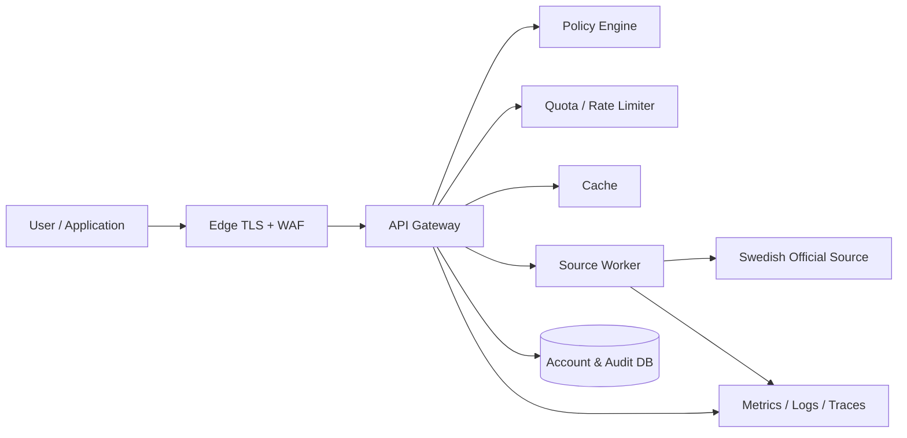

# Sweden: Security-First Rust SDK and Hosted API Platform
## Initial Technical Architecture and Design Discussion

**Project:** `sweden`
**Document status:** Architecture baseline for implementation
**Verified against public-source information available on 28 July 2026**
**Primary implementation toolchain:** Rust 1.97.1
**Public SDK minimum supported Rust version (MSRV):** Rust 1.90.0
**Primary target:** a legal, source-respecting, secure, strongly typed Rust interface to Swedish public APIs and public datasets

---

## 0. Executive decisions

The project should be built, but several decisions in the original notes need to be corrected before implementation.

### 0.1 The public package should be `sweden`

The reference to `hrafnsyn-sdk` is treated as a copy-and-paste mistake. The public package should be:

```toml
[dependencies]
sweden = "1"
```

The public namespace should expose agency modules such as:

```rust
sweden::trafikverket
sweden::smhi
sweden::scb
sweden::skatteverket
```

The correct spelling is **Trafikverket**, so the package/module name must be `trafikverket`, not `traffiksverket`.

### 0.2 Every reusable crate is published

The canonical design is a fully published multi-crate ecosystem:

```text
sweden
 ├── sweden-core
 ├── sweden-http
 ├── sweden-trafikverket
 ├── sweden-smhi
 ├── sweden-scb
 ├── sweden-jobtech
 └── sweden-skatteverket
```

Every crate is independently packageable and publishable to crates.io. The
root `sweden` crate becomes a feature-gated facade as integrations are
introduced. Agency crates depend inward on `sweden-core`; they never depend on
the facade or on another agency crate.
Service, generator, testkit, and administration packages are also publishable
when they are Rust crates. No crate is intentionally GitHub-only.

This is the end-state package map, not a requirement to publish placeholders.
The `0.1.0` workspace starts with only `sweden-core` and `sweden`.
`sweden-http`, `sweden-testkit`, `sweden-schema`, and
`sweden-trafikverket` are created when their planned implementation begins;
the remaining named agency crates begin after `1.0.0`. Every crate is still
published to crates.io once introduced.

### 0.3 Do not implement a custom TLS stack

There should not be a `sweden-tls` cryptographic implementation. TLS is a transport concern, not a Swedish API domain concern.

The SDK must:

- define transport-neutral request and response contracts;
- allow user-supplied transports;
- offer optional adapters for maintained TLS-capable HTTP clients;
- never implement certificates, TLS handshakes, cipher suites, signature verification, or trust stores itself.

A custom TLS stack would substantially increase security risk, audit cost, and legal exposure without improving the Swedish API abstraction.

### 0.4 `no_std` applies to domain logic, not Internet access

The project should define three support tiers:

| Tier | Environment | Scope |
|---|---|---|
| Core | `core` only | borrowed request descriptions, validated scalar types, error codes, endpoint metadata |
| Alloc | `core + alloc` | owned models, JSON/XML decoding, dynamic collections, buffered request generation |
| Standard | `std` | sockets, TLS adapters, filesystem cache, environment credentials, hosted service |

The SDK must compile without `std` for source modeling, validation, encoding, and decoding where practical. It should not pretend that an operating-system-independent Internet client can perform DNS, TCP, certificate validation, and TLS without a platform-specific network stack.

### 0.5 Source rules are executable policy

Every source integration must include machine-readable policy metadata covering:

- access category;
- authentication mechanism;
- official terms revision and review date;
- attribution requirements;
- redistribution rights;
- caching rules;
- transformation restrictions;
- personal-data classification;
- default rate limits;
- hosted-relay permission;
- log-redaction requirements;
- permitted retry behavior.

The hosted service must refuse operations that its checked-in policy marks as prohibited. Legal compliance cannot exist only as prose in a README.

### 0.6 Trafikverket is the 1.0 flagship, not the only architecture target

All shared architecture must be complete before 1.0.0. Trafikverket must be production-complete before 1.0.0. A smaller source may be used during the 0.x series to test the onboarding framework, but Trafikverket remains the stable 1.0 domain.

---

# 1. Product definition

## 1.1 Mission

`sweden` is a security-first Rust SDK and optional hosted API platform for lawful, strongly typed access to Swedish public-sector APIs and public datasets.

It should make the safe path the easy path:

- typed request builders instead of hand-built URLs or XML;
- bounded parsers instead of unconstrained response loading;
- automatic source attribution where required;
- source-aware rate limiting;
- explicit handling of open, registered, partner, and targeted APIs;
- provenance metadata attached to normalized results;
- no secret leakage in logs or errors;
- no unsupported claim that every public dataset may be proxied, cached, modified, or redistributed.

## 1.2 Primary user groups

1. **Rust application developers**
   They need strongly typed source APIs, minimal dependencies, predictable errors, and optional sync/async network adapters.

2. **Embedded and constrained-system developers**
   They need `no_std` request generation, response parsing, and domain types while providing their own transport.

3. **Data engineers**
   They need streaming, pagination, bulk-download support, schema snapshots, stable provenance, and resumable ingestion.

4. **Public-sector and regulated organizations**
   They need auditable source terms, credential isolation, retention controls, data classifications, and deterministic request behavior.

5. **Web/API consumers**
   They need a hosted gateway for sources whose terms permit relaying, plus a catalog and playground that clearly distinguish relayed, direct-only, and agreement-required sources.

## 1.3 Product surfaces

The project has four product surfaces:

### A. The crates.io SDK

```text
sweden
sweden-core
sweden-http
sweden-trafikverket
sweden-smhi
sweden-scb
sweden-jobtech
sweden-skatteverket
```

Every reusable API or support boundary is a public, independently documented
crate. `sweden` remains the preferred facade for users who want several
integrations.

### B. The hosted API

A source-aware API gateway that:

- exposes only registered SDK operations;
- never acts as an arbitrary URL proxy;
- enforces source-specific quotas and terms;
- preserves upstream provenance;
- supports API keys, usage reporting, and audit events;
- disables sources automatically when policy review expires or terms materially change.

### C. The website

The website provides:

- source catalog;
- endpoint documentation;
- legal/access classification;
- interactive examples;
- API key management;
- source status;
- changelog and upstream compatibility information;
- downloadable schema snapshots where redistribution permits;
- a clear “direct integration required” path for partner APIs.

### D. Internal tooling

Internal packages and tools provide:

- source scaffolding;
- schema acquisition and diffing;
- code generation;
- fixture sanitization;
- live contract tests;
- legal-policy review workflows;
- website documentation generation;
- release and provenance automation.

## 1.4 Non-goals

The project must not:

- scrape sites when an official API or official bulk export is intended;
- bypass authentication, quotas, paywalls, contracts, or access controls;
- offer a generic proxy to Swedish government domains;
- submit legally binding declarations on a user’s behalf unless an official API and agreement explicitly permit the exact operation;
- store BankID secrets, private keys, or organization credentials in the SDK;
- implement BankID, OAuth2, TLS, X.509, or cryptographic primitives from scratch;
- silently merge incompatible source semantics into a misleading universal model;
- alter a dataset when its source terms prohibit modification;
- imply endorsement by a Swedish authority;
- treat “publicly visible” as automatically “free of personal-data obligations.”

---

# 2. Architectural principles

## 2.1 Domain-first, transport-second

Agency crates/modules describe official operations. They do not directly call a hard-coded HTTP client.

A source operation performs these stages:

```text
validated input
    ↓
typed operation
    ↓
request plan
    ↓
policy preflight
    ↓
transport execution
    ↓
bounded body handling
    ↓
source decoder
    ↓
semantic validation
    ↓
provenance-wrapped result
```

This allows the same source operation to work with:

- blocking desktop transport;
- async server transport;
- embedded network stack;
- deterministic mock transport;
- replay fixture;
- hosted gateway;
- air-gapped request generation.

## 2.2 Preserve source truth

A common envelope may be normalized, but source-specific payloads remain source-specific.

Recommended response shape:

```rust
pub struct Sourced<T> {
    pub meta: Provenance,
    pub data: T,
}
```

`Provenance` includes:

- source ID;
- operation ID;
- upstream API version;
- schema snapshot ID;
- retrieval time;
- upstream publication/reference time when available;
- source request/correlation ID;
- content encoding;
- licence/attribution reference;
- whether the payload is raw, decoded, normalized, cached, or transformed;
- transformations applied;
- freshness and cache information.

Do not map every authority’s data into one “government record” abstraction. A train announcement, a weather observation, a company record, a parliamentary document, and a municipal statistic have different semantics and legal constraints.

## 2.3 Bounded by default

Every operation must have explicit budgets:

- maximum response bytes;
- maximum decompressed bytes;
- maximum nesting depth;
- maximum string length;
- maximum collection elements;
- maximum pages;
- maximum total records;
- maximum redirect count;
- timeout budget;
- retry budget.

There must be no public convenience call that accidentally downloads an unbounded dataset into a `Vec`.

## 2.4 No hidden network behavior

The SDK must not:

- retry without exposing the policy;
- follow redirects across unapproved hosts;
- refresh credentials unexpectedly;
- send telemetry;
- resolve arbitrary URLs from upstream payloads;
- change HTTP methods;
- convert an idempotent operation into a non-idempotent one;
- perform build-time downloads.

## 2.5 Upstream changes are first-class events

Every source adapter has:

- upstream version;
- schema snapshot;
- terms snapshot metadata;
- generator version;
- hand-written patch layer;
- compatibility test set;
- deprecation state.

An upstream schema change should produce a reviewable pull request, not silently alter generated code during `cargo build`.

---

# 3. Swedish source taxonomy

The architecture must classify a source before code is written.

## 3.1 Access classes

```rust
pub enum AccessClass {
    OpenAnonymous,
    OpenRegistered,
    OpenWithApiKey,
    PartnerAgreement,
    TargetedAuthorization,
    PaidContract,
    BulkDownload,
    HumanPortalOnly,
}
```

### Open anonymous

No user-specific registration is required. Source rules and rate limits still apply.

### Open registered or API-key access

The data may be open, but the provider requires a developer account, API key, OAuth client, or identified caller.

### Partner agreement

The caller must qualify, apply, sign an agreement, and use approved credentials. The hosted service must not pool its own credential to give unapproved third parties access unless the provider explicitly authorizes that service model.

### Targeted authorization

The API is intended for named authorities or specifically authorized parties. It belongs in the catalog only as a documented, disabled-by-default integration framework until authorization exists.

### Paid contract

Use requires payment or a commercial agreement. The SDK may support customer-provided credentials, but the project must not redistribute the data without permission.

### Bulk download

The official interface is a file, feed, or archive rather than an interactive API. The SDK needs resumable downloads, checksum/provenance handling, and streaming decoders rather than pretending it is a normal REST endpoint.

### Human portal only

Do not automate unless an official automation interface or explicit permission exists.

## 3.2 Hosted-service disposition

Each operation receives one of:

```rust
pub enum HostedUse {
    RelayAllowed,
    RelayAllowedWithAttribution,
    CacheOnlyWithinLimits,
    DirectClientOnly,
    ContractRequired,
    Disabled,
}
```

The distinction is critical. “The SDK can construct this request” does not mean “the project’s public gateway may proxy it for anyone.”

## 3.3 Data classes

```rust
pub enum DataClass {
    PublicNonPersonal,
    PublicPotentiallyPersonal,
    Personal,
    SensitivePersonal,
    Confidential,
    SecurityRelevant,
    Unknown,
}
```

`Unknown` is fail-closed for hosted logging, caching, and analytics.

The source may offer multiple operations with different classifications. Classification belongs at operation level, not only agency level.

---

# 4. Initial source portfolio and release priority

The following is the recommended portfolio. Exact endpoint inventories and current terms must be revalidated when each adapter is implemented.

| Source | Typical access | Interface style | Main concerns | Target |
|---|---|---|---|---|
| Trafikverket | Registered/API key | Traffic API, structured queries and responses | terms, key handling, query complexity, quotas | 1.0 flagship |
| SMHI | Mostly open anonymous | REST and downloadable data in several formats | version pinning, large data, scientific units | 1.1 |
| Polisen | Open anonymous with strict usage rules | JSON REST | mandatory User-Agent, strict call cadence, no scraping | 1.1 |
| SCB | Open anonymous | PxWeb API v2 | cell limits, burst limits, multidimensional data | 1.2 |
| Riksbanken | Open, with access tiers/rate limits | multiple statistical APIs | attribution, time-series semantics, quotas | 1.2 |
| JobTech | Open data plus separate partner operations | REST/OpenAPI and feeds | CC0 datasets vs registration-required posting | 1.3 |
| Riksdagen | Open anonymous | REST, datasets, multiple serializations | large historical corpus, document formats | 1.3 |
| Lantmäteriet | open geodata plus other products | files, geodata services | coordinates, projections, very large payloads | 1.4 |
| SGU | Open geological data | OGC APIs, GeoJSON, files, raster services | geospatial complexity and large files | 1.4 |
| Kolada | Open API | OpenAPI/REST | dimensions, municipal identifiers, time series | 1.4 |
| Bolagsverket high-value data | Free but registered OAuth/API access | REST | key/OAuth handling, 60/minute default, company data | 1.5 |
| Skatteverket open data | Open anonymous or downloadable | REST/JSON and files | strict separation from partner/targeted APIs | 1.5 |
| Skatteverket partner APIs | Agreement and credentials | REST/JSON, primarily OAuth2 | legal qualification, user signing, no credential pooling | later/direct only |
| Trafiklab/ResRobot | Registered/API key | OpenAPI REST | key limits, public-transport identifiers | 1.6 |
| Valmyndigheten | Open bulk publication | CSV/files | election-version provenance, immutable snapshots | 1.6 |
| Naturvårdsverket | Mixed open and restricted | API catalog, REST/OGC/files | source-by-source rights and environmental schemas | 1.7 |
| Läkemedelsverket | Open datasets under attribution terms | datasets/API where offered | medicinal data semantics and attribution | 1.7 |
| Livsmedelsverket | Official datasets/downloads | bulk data | attribution and source-specific no-modification rule | 1.8 |
| Sveriges dataportal | Open metadata catalog | metadata API/RDF | discovery only; never assume catalog licence equals dataset licence | 1.8 |

## 4.1 Why Trafikverket belongs at 1.0

Trafikverket is a strong 1.0 test because it requires more than a trivial JSON GET:

- registered access;
- source-specific request construction;
- multiple data domains;
- potentially large responses;
- important freshness semantics;
- source traffic monitoring;
- a need for safe filters and query budgets;
- a large enough model to prove that onboarding does not degrade maintainability.

## 4.2 Why a small pilot still helps

Before implementing the full Trafikverket model, use a small source or a local conformance source to prove:

- transport abstraction;
- strict rate-limit metadata;
- source policy enforcement;
- bounded JSON decoding;
- mock/replay tests;
- hosted gateway registration;
- documentation generation.

Polisen is useful as an experimental pilot because its published use rules are unusually explicit. It should remain behind an `unstable-polisen` feature until stabilized after 1.0 if the release policy requires Trafikverket to be the only stable source.

---

# 5. Repository and distribution architecture

## 5.1 Canonical workspace

```text
sweden/
├── Cargo.toml
├── rust-toolchain.toml
├── rustfmt.toml
├── clippy.toml
├── deny.toml
├── SECURITY.md
├── CONTRIBUTING.md
├── GOVERNANCE.md
├── CODE_OF_CONDUCT.md
├── LICENSES/
├── NOTICE.md
├── docs/
│   ├── architecture/
│   ├── legal/
│   ├── source-reviews/
│   ├── threat-model/
│   ├── runbooks/
│   └── adr/
├── policy/
│   ├── schema/
│   └── sources/
├── specs/
│   ├── manifests/
│   ├── trafikverket/
│   ├── smhi/
│   └── ...
├── fixtures/
│   ├── public/
│   └── generated/
├── crates/
│   ├── sweden/                    # published facade
│   ├── sweden-core/               # published shared contracts
│   ├── sweden-http/               # published std transport boundary
│   ├── sweden-trafikverket/       # published agency crate
│   ├── sweden-smhi/               # published agency crate
│   ├── sweden-scb/                # published agency crate
│   ├── sweden-jobtech/            # published agency crate
│   ├── sweden-skatteverket/       # published agency crate
│   ├── sweden-gateway/            # published service library/binary crate
│   ├── sweden-schema/             # published generator library/binary crate
│   └── sweden-testkit/            # published test support crate
├── apps/
│   ├── api/
│   ├── worker/
│   ├── web/
│   ├── admin/
│   └── status/
├── deploy/
│   ├── containers/
│   ├── kubernetes/
│   ├── systemd/
│   └── local/
└── .github/
    ├── workflows/
    ├── ISSUE_TEMPLATE/
    └── dependabot.yml
```

## 5.2 Public crate source tree

```text
crates/sweden/src/
├── lib.rs
├── client/
│   ├── mod.rs
│   ├── builder.rs
│   ├── blocking.rs
│   └── asynchronous.rs
├── core/
│   ├── mod.rs
│   ├── endpoint.rs
│   ├── error.rs
│   ├── headers.rs
│   ├── method.rs
│   ├── request.rs
│   ├── response.rs
│   ├── retry.rs
│   ├── time.rs
│   └── validation.rs
├── body/
│   ├── mod.rs
│   ├── budget.rs
│   ├── sink.rs
│   ├── buffer.rs
│   └── stream.rs
├── transport/
│   ├── mod.rs
│   ├── blocking.rs
│   ├── asynchronous.rs
│   ├── mock.rs
│   ├── ureq_adapter.rs
│   └── reqwest_adapter.rs
├── codec/
│   ├── mod.rs
│   ├── json.rs
│   ├── xml.rs
│   ├── csv.rs
│   ├── text.rs
│   └── limits.rs
├── auth/
│   ├── mod.rs
│   ├── api_key.rs
│   ├── bearer.rs
│   ├── oauth.rs
│   ├── secret.rs
│   └── provider.rs
├── policy/
│   ├── mod.rs
│   ├── access.rs
│   ├── attribution.rs
│   ├── cache.rs
│   ├── classification.rs
│   ├── licence.rs
│   ├── rate.rs
│   └── source.rs
├── provenance/
│   ├── mod.rs
│   ├── transform.rs
│   └── freshness.rs
├── geo/
│   ├── mod.rs
│   ├── coordinate.rs
│   ├── bbox.rs
│   └── crs.rs
├── pagination/
│   ├── mod.rs
│   ├── cursor.rs
│   ├── page.rs
│   └── budget.rs
└── agencies/
    ├── mod.rs
    ├── trafikverket/
    ├── smhi/
    ├── polisen/
    ├── scb/
    └── ...
```

## 5.3 Workspace dependency direction

Allowed:

```text
apps/api
  → sweden-gateway
    → sweden-service-core
      → sweden
```

Forbidden:

```text
sweden-core → sweden
agency crate → sweden
agency crate → another agency crate
```

`sweden-core` is the lowest reusable layer. The root facade depends outward
only to re-export explicitly selected public crates.

## 5.4 Publish controls

Every crate must carry complete crates.io metadata and pass an isolated package
check. Publication follows dependency order:

```text
sweden-core
    ↓
sweden-http and agency crates
    ↓
service/tool crates
    ↓
sweden
```

The release workflow runs `cargo package` for every workspace crate and proves
that no package relies on an unpublished or undeclared path-only dependency.

in a clean environment where no workspace path outside the packaged crate is available.

---

# 6. Public crate features and compatibility

## 6.1 Recommended feature set

```toml
[features]
default = [
    "std",
    "blocking",
    "rustls",
    "trafikverket",
]

# Runtime tiers
alloc = []
std = ["alloc"]

# Client style
blocking = ["std"]
async = ["std"]

# Optional maintained transport adapters
ureq = ["blocking"]
reqwest = ["async"]
rustls = ["std"]
native-tls = ["std"]

# Codecs
json = ["alloc"]
xml = ["alloc"]
csv = ["alloc"]

# Shared domains
geo = ["alloc"]
time = []
oauth = ["std", "alloc"]

# Sources
trafikverket = ["alloc", "json", "xml"]
smhi = ["alloc", "json", "geo"]
polisen = ["alloc", "json"]
scb = ["alloc", "json"]
riksbanken = ["alloc", "json"]
jobtech = ["alloc", "json"]
riksdagen = ["alloc", "json", "xml"]
lantmateriet = ["alloc", "geo"]
sgu = ["alloc", "json", "geo"]
kolada = ["alloc", "json"]
bolagsverket = ["alloc", "json", "oauth"]
skatteverket-open = ["alloc", "json"]
trafiklab = ["alloc", "json"]
valmyndigheten = ["alloc", "csv"]

# Development/compatibility
raw = ["alloc"]
serde = ["alloc"]
full = [
    "std",
    "blocking",
    "async",
    "rustls",
    "json",
    "xml",
    "csv",
    "geo",
    # source features are added as stabilized
]
```

Feature names should be additive. A feature must not silently weaken validation, enable telemetry, or change legal behavior.

## 6.2 MSRV policy

The `sweden` crate:

- has MSRV 1.90.0;
- compiles and tests on Rust 1.90.0;
- compiles and tests on Rust 1.97.1;
- treats accidental MSRV increases as semver-relevant;
- documents the MSRV in `Cargo.toml`, README, and release notes.

Internal server packages may use Rust 1.97.1 features.

The shared code in `sweden` must not use newer syntax merely because the server workspace can.

## 6.3 Target matrix

At minimum:

```text
x86_64-unknown-linux-gnu
x86_64-unknown-linux-musl
aarch64-unknown-linux-gnu
x86_64-pc-windows-msvc
aarch64-apple-darwin
wasm32-unknown-unknown        # model/build-only where networking is unavailable
thumbv7em-none-eabihf         # core/no_std compile test
riscv32imac-unknown-none-elf  # core/no_std compile test
```

Not every source parser must fit every embedded target, but feature combinations must fail at compile time with clear documentation rather than fail mysteriously at runtime.

---

# 7. Core request architecture

## 7.1 Request plan, not immediate network call

An operation should produce a `RequestPlan`:

```rust
pub struct RequestPlan<'a> {
    pub source: SourceId,
    pub operation: OperationId,
    pub method: Method,
    pub authority: Authority<'a>,
    pub path: Path<'a>,
    pub query: Query<'a>,
    pub headers: HeaderSet<'a>,
    pub body: RequestBody<'a>,
    pub limits: Limits,
    pub retry: RetryClass,
    pub policy: PolicyRef,
}
```

The authority must come from a closed, compiled source descriptor. User input must never choose the host.

## 7.2 Closed-host model

```rust
pub enum SourceHost {
    TrafikverketProduction,
    TrafikverketTest,
    SmhiOpenData,
    ScbApi,
    // ...
}
```

The transport resolves a `SourceHost` to an approved HTTPS origin.

This prevents:

- SSRF through a user-supplied URL;
- credential forwarding to an attacker-controlled host;
- accidental HTTP downgrade;
- redirects to unapproved origins.

An advanced custom-origin feature may exist only for tests and explicitly trusted enterprise deployments. It must never be enabled in the public hosted gateway.

## 7.3 Header model

The SDK must own security-relevant headers:

- `Authorization`;
- API-key headers or query fields;
- `User-Agent`;
- `Accept`;
- `Content-Type`;
- conditional cache headers;
- request/correlation IDs.

A source module may define static and dynamic headers, but callers must not be able to override protected headers accidentally.

Use separate header classes:

```rust
pub enum HeaderOrigin {
    SdkRequired,
    SourceRequired,
    AuthProvider,
    UserSafe,
}
```

Protected duplicates must produce an error.

## 7.4 Request identity

Every request plan receives a stable operation ID, for example:

```text
trafikverket.traffic.query.v1
scb.pxweb.table.query.v2
polisen.events.list.v1
```

This ID drives:

- policy lookup;
- metrics;
- documentation;
- quota rules;
- test fixtures;
- deprecation warnings;
- compatibility reports.

Do not use raw paths as the stable identity.

---

# 8. Transport contracts

## 8.1 Blocking transport

A naive `get(&str) -> Vec<u8>` is insufficient. It cannot represent:

- POST operations;
- headers;
- streaming;
- response limits;
- timeout/cancellation;
- request bodies;
- status metadata;
- redirects;
- decompression budgets.

Recommended shape:

```rust
pub trait BlockingTransport {
    type Error;

    fn execute<S>(
        &self,
        request: &PreparedRequest<'_>,
        sink: &mut S,
    ) -> Result<ResponseMeta, TransportFailure<Self::Error>>
    where
        S: BodySink;
}
```

The `BodySink` receives chunks and can stop when a configured limit is exceeded.

## 8.2 Async transport

Static-dispatch async support may use an `async fn` trait on the supported MSRV:

```rust
pub trait AsyncTransport {
    type Error;

    async fn execute<S>(
        &self,
        request: &PreparedRequest<'_>,
        sink: &mut S,
    ) -> Result<ResponseMeta, TransportFailure<Self::Error>>
    where
        S: AsyncBodySink + Send;
}
```

Because async trait methods are not automatically suitable for every dynamic-dispatch use case, the SDK should also provide an alloc/std boxed adapter for applications that need heterogeneous transports.

## 8.3 Required transport behavior

Every built-in transport adapter must:

- require HTTPS for production source hosts;
- validate certificates through a maintained TLS implementation;
- set connection, read, and overall deadlines;
- restrict redirects;
- reject cross-origin redirects by default;
- enforce compressed and decompressed size budgets;
- expose status and selected response headers;
- preserve upstream request IDs;
- avoid logging secret headers;
- make proxy use explicit;
- make environment-proxy use explicit rather than surprising;
- expose DNS and TLS errors without including credentials;
- support cancellation in async contexts.

## 8.4 Adapter policy

The SDK may support optional adapters such as:

- a lightweight blocking client;
- an async ecosystem client;
- user-provided custom transport.

Transport dependencies must be optional. No adapter should be required for `no_std` request construction or decoding.

## 8.5 No network during build

The crate must never fetch schemas or contact authorities in `build.rs`.

Generated code and schema snapshots are checked into the repository. A separate maintainer command performs upstream synchronization.

---

# 9. Body, streaming, and decoding budgets

## 9.1 Body sink API

```rust
pub trait BodySink {
    type Error;

    fn reserve_hint(&mut self, additional: usize) -> Result<(), Self::Error>;
    fn write_chunk(&mut self, bytes: &[u8]) -> Result<(), Self::Error>;
    fn finish(&mut self) -> Result<(), Self::Error>;
}
```

Implementations:

- fixed caller-provided buffer;
- bounded `Vec<u8>`;
- streaming JSON event decoder;
- streaming XML event decoder;
- CSV record consumer;
- file writer under `std`;
- content hash plus file writer;
- discard sink for metadata-only requests.

## 9.2 Dual size limits

Compressed responses require two limits:

```rust
pub struct BodyLimits {
    pub max_wire_bytes: u64,
    pub max_decoded_bytes: u64,
    pub max_expansion_ratio: u32,
}
```

This mitigates decompression bombs.

## 9.3 Decoder limits

```rust
pub struct DecodeLimits {
    pub max_depth: u16,
    pub max_string_bytes: u32,
    pub max_array_items: u32,
    pub max_object_fields: u16,
    pub max_number_bytes: u16,
    pub max_total_tokens: u64,
}
```

Agency operations select a safe default. The caller may lower limits. Raising above a source-reviewed ceiling requires an explicit unsafe-in-the-operational-sense override, named clearly such as `with_extended_limits`.

## 9.4 XML safety

XML handling must:

- reject external entities;
- reject DTD processing unless a reviewed operation explicitly requires it;
- cap nesting depth;
- cap attributes per element;
- cap text size;
- cap namespace declarations;
- avoid recursive allocation;
- reject duplicate security-sensitive fields where ambiguity could matter;
- preserve unknown safe elements for forward compatibility where practical.

Do not write a full custom XML standard implementation for this project.

## 9.5 JSON safety

JSON decoding must:

- be bounded;
- reject duplicate fields for security-sensitive request/response objects when ambiguity matters;
- preserve unknown fields where forward compatibility is required;
- reject non-finite numbers unless the source explicitly defines them;
- avoid unbounded `Value` trees for large tabular responses;
- provide streaming table/record APIs.

---

# 10. Error architecture

## 10.1 Stable error categories

```rust
#[non_exhaustive]
pub enum ErrorKind {
    InvalidInput,
    PolicyDenied,
    Authentication,
    Authorization,
    RateLimited,
    Timeout,
    Dns,
    Tls,
    Connect,
    Transport,
    HttpStatus,
    Decode,
    SchemaMismatch,
    SemanticValidation,
    ResponseTooLarge,
    RetryExhausted,
    UpstreamUnavailable,
    Unsupported,
    Internal,
}
```

## 10.2 Structured context

```rust
pub struct ErrorContext {
    pub source: Option<SourceId>,
    pub operation: Option<OperationId>,
    pub request_id: Option<SafeRequestId>,
    pub status: Option<u16>,
    pub retry_after: Option<Duration>,
    pub retryable: bool,
    pub field: Option<FieldPath>,
}
```

No error type may contain:

- API keys;
- bearer tokens;
- client secrets;
- full credential-bearing URLs;
- raw authorization headers;
- sensitive payload fragments.

## 10.3 Source errors

Authorities often return a valid HTTP response containing a source-specific error. Preserve:

- machine-readable upstream code;
- safe message;
- field/path;
- source request ID;
- retry advice;
- raw body only behind a deliberate diagnostics feature and only after redaction.

## 10.4 Retry advice

The SDK should expose:

```rust
pub enum RetryAdvice {
    Never,
    SameRequestAfter(Duration),
    RefreshCredentialsThenRetry,
    RetryWithBackoff,
    CallerDecision,
}
```

The SDK must not retry a non-idempotent operation by default.

---

# 11. Validation and shared domain types

## 11.1 Validated newtypes

Use types for values that have rules:

```rust
pub struct Latitude(f64);
pub struct Longitude(f64);
pub struct SwedishOrganisationNumber(...);
pub struct SwedishMunicipalityCode(...);
pub struct CountyCode(...);
pub struct StationId(...);
pub struct Date(...);
pub struct Timestamp(...);
pub struct PageSize(...);
```

Validation should occur at construction.

## 11.2 Sensitive identifiers

A public identifier can still be personal data. Types that may represent people must:

- redact or truncate `Debug` by default;
- not implement `Display` unless safe and useful;
- expose explicit methods such as `expose()` rather than implicit string conversion;
- carry operation-level logging policy.

## 11.3 Time

Avoid ambiguous local timestamps.

Every parsed timestamp should preserve:

- original text where needed;
- instant/offset;
- source timezone assumptions;
- whether the timestamp was provided or inferred;
- precision.

Swedish local-time conversion belongs behind an optional time-zone implementation. Do not silently assume every timestamp is Europe/Stockholm.

## 11.4 Geospatial types

The geo module should support:

- validated WGS84 coordinates;
- bounding boxes;
- coordinate order made explicit;
- CRS identifiers;
- source-declared axis order;
- conversion hooks rather than a home-grown projection library;
- antimeridian and invalid-area checks.

Large geospatial support should be optional.

---

# 12. Authentication and secret handling

## 12.1 Credential providers

```rust
pub trait CredentialProvider {
    fn credential(
        &self,
        source: SourceId,
        scope: CredentialScope,
    ) -> Result<CredentialRef<'_>, CredentialError>;
}
```

Providers may read from:

- caller-owned memory;
- environment variables;
- process secret mounts;
- operating-system credential stores;
- HSM/Vault-style systems;
- OAuth token managers.

The core SDK does not decide where secrets live.

## 12.2 Secret type behavior

Secret wrappers must:

- redact `Debug`;
- avoid `Clone` unless necessary;
- avoid accidental serialization;
- minimize lifetime;
- support best-effort memory clearing where technically meaningful;
- not claim guaranteed erasure on all platforms;
- never appear in URLs returned by errors or telemetry.

## 12.3 API keys

For source APIs that accept a key in query XML, query strings, or headers:

- inject the key as late as possible;
- keep an uncredentialed request plan available for logs;
- maintain a redacted canonical request representation;
- never cache a credentialed URL as a cache key;
- derive cache keys from the operation and normalized non-secret inputs.

## 12.4 OAuth2

Do not implement OAuth2 cryptography or token parsing from scratch.

The OAuth integration layer defines:

- client-credentials provider;
- authorization-code provider only where the source requires it;
- token endpoint allowlist;
- scope allowlist;
- refresh policy;
- clock-skew handling;
- secret redaction;
- token cache isolation by tenant and source.

## 12.5 Partner API tenancy

For partner APIs:

- each customer uses its own approved organization/client identity unless an agreement explicitly permits a shared service identity;
- credentials are tenant-isolated;
- access requires a policy record containing agreement ID, expiry, approved scopes, and authorized environment;
- the hosted service fails closed after agreement expiry;
- test/sandbox credentials cannot be used against production;
- production credentials cannot be used in replay tests.

---

# 13. Source policy manifests

## 13.1 Manifest example

```toml
schema = 1

[source]
id = "polisen"
display_name = "Polismyndigheten"
homepage = "official-source-reference"
reviewed_at = "2026-07-28"
review_after = "2026-10-28"

[access]
class = "open-anonymous"
hosted_use = "relay-allowed-with-attribution"

[transport]
https_required = true
allowed_hosts = ["official-host-placeholder"]
redirects = "same-origin-only"
required_user_agent = true

[rate]
strategy = "fixed-window"
minimum_interval_seconds = 10
max_requests_per_hour = 60
max_requests_per_day = 1440
retry_404 = false

[data]
classification = "public-potentially-personal"
log_payload = false
cache = "short-lived"
redistribution = "reviewed"

[attribution]
required = true
text = "Source attribution template"

[terms]
reference = "terms-document-id"
content_hash = "sha256:..."
```

Official hosts and exact terms references are filled during implementation review.

## 13.2 Compiled policy

At build/release time, the policy compiler:

- validates manifest schema;
- rejects missing review dates;
- rejects contradictory rules;
- compiles stable IDs into the SDK/service;
- generates documentation tables;
- generates hosted gateway allowlists;
- generates tests for limits and attribution;
- produces a signed policy bundle for deployment.

## 13.3 Runtime policy expiry

The hosted gateway should support:

```text
active → review_due → read_only/cache_only → disabled
```

A terms review expiring should not silently permit continued unrestricted relay. The exact failover mode is source-specific.

## 13.4 Licence is not enough

A source policy must distinguish:

- copyright/database licence;
- access terms;
- API operational rules;
- attribution;
- privacy/data protection;
- confidentiality;
- contract restrictions;
- redistribution;
- transformation;
- caching;
- branding/endorsement.

A CC licence on data does not automatically override an API’s operational terms.

---

# 14. Rate limiting, retry, and backpressure

## 14.1 Source-aware limiter

The limiter key includes:

```text
source
operation
credential identity
tenant
upstream origin
```

This prevents one tenant from consuming another tenant’s allowance.

## 14.2 Limit strategies

Support:

- minimum interval;
- fixed window;
- sliding window;
- token bucket;
- concurrency cap;
- daily cap;
- response-header-driven limit;
- contract-configured limit.

## 14.3 Distributed hosted limiter

The hosted service needs an atomic distributed limiter. The storage implementation may use a dedicated rate-limit store or database, but the semantic interface must be implementation-independent.

Failure policy:

- for strict source limits, limiter-store failure is fail-closed;
- for low-risk local quotas, a bounded local fallback may be allowed;
- never “fail open” and flood an authority.

## 14.4 Retry behavior

Default retry eligibility:

| Condition | Default |
|---|---|
| DNS/transient connect failure | bounded retry for idempotent request |
| TLS verification failure | never |
| HTTP 401/403 | never, except one reviewed credential refresh |
| HTTP 404 | source-specific; often never |
| HTTP 408/429 | respect `Retry-After`, source policy |
| HTTP 500/502/503/504 | bounded exponential backoff for idempotent request |
| decode/schema error | never |
| response too large | never |
| policy denial | never |

Use full jitter and an overall deadline. A retry budget must be smaller than the request deadline.

## 14.5 Caller-visible backpressure

Streaming ingestion must allow sinks to slow or stop delivery. The transport must not keep allocating while a consumer is backpressured.

---

# 15. Caching and freshness

## 15.1 Cache decision inputs

Cacheability depends on:

- source terms;
- operation;
- authentication;
- data class;
- upstream cache headers;
- requested freshness;
- transformation status;
- tenant isolation.

## 15.2 Cache key

```text
source ID
operation ID
upstream version
normalized non-secret inputs
representation
schema snapshot
policy version
```

Never include raw credentials.

## 15.3 Cache record

```rust
pub struct CacheRecord<T> {
    pub value: T,
    pub fetched_at: Timestamp,
    pub upstream_age: Option<Duration>,
    pub expires_at: Option<Timestamp>,
    pub etag: Option<SafeEtag>,
    pub last_modified: Option<Timestamp>,
    pub provenance: Provenance,
    pub policy_version: PolicyVersion,
}
```

## 15.4 Stale behavior

Support explicit strategies:

- require fresh;
- allow stale for a bounded interval;
- stale-if-error;
- cache-only;
- bypass cache.

The API response must report which strategy produced the result.

## 15.5 Transform restrictions

If a source prohibits modification:

- raw data is stored byte-for-byte;
- parsed views are marked as derived;
- exports cannot be presented as the source’s original dataset;
- transformations are disabled where terms require exact preservation;
- content hashes prove raw-object identity.

---

# 16. Pagination and bulk data

## 16.1 Pagination abstraction

```rust
pub struct PageRequest<C> {
    pub cursor: Option<C>,
    pub limit: PageSize,
}

pub struct Page<T, C> {
    pub items: Vec<T>,
    pub next: Option<C>,
    pub total_hint: Option<u64>,
}
```

Source-specific pagination remains visible. Offset, cursor, time-window, and feed checkpoint semantics must not be conflated.

## 16.2 Collection budget

```rust
pub struct CollectionBudget {
    pub max_pages: u32,
    pub max_records: u64,
    pub max_bytes: u64,
    pub max_elapsed: Duration,
}
```

`collect_all()` must require a budget argument.

## 16.3 Bulk download protocol

Bulk adapters should support:

- `HEAD`/metadata discovery where permitted;
- conditional downloads;
- resumable ranges where supported;
- checksum verification;
- content-length limits;
- archive-entry limits;
- path traversal protection during extraction;
- compressed/decompressed ratio limits;
- atomic publication;
- source snapshot ID;
- immutable raw archive retention where allowed;
- streaming row/object processing.

## 16.4 Archive safety

Reject:

- absolute paths;
- `..` traversal;
- symlink escape;
- duplicate paths with ambiguous overwrite;
- too many entries;
- oversized entries;
- nested archive bombs;
- special device nodes.

---

# 17. Code generation and schema management

## 17.1 Never generate from live network during compilation

Workflow:

```text
official schema/spec
    ↓ maintainer fetch
content hash + metadata
    ↓
reviewed snapshot in specs/
    ↓
generator
    ↓
checked-in generated Rust
    ↓
hand-written facade
```

## 17.2 Spec manifest

```toml
source = "trafikverket"
upstream_version = "reviewed-value"
retrieved_at = "2026-07-28T00:00:00Z"
official_reference = "source-document-reference"
sha256 = "..."
licence = "reviewed"
generator = "sweden-schema 0.x"
patches = ["patches/001-nullability.toml"]
```

## 17.3 Generated/hand-written boundary

```text
agencies/trafikverket/
├── mod.rs
├── client.rs
├── query/
├── facade/
├── generated/
│   ├── mod.rs
│   ├── objects/
│   └── enums/
└── compatibility.rs
```

Generated files:

- clearly marked;
- never manually edited;
- deterministic;
- rustfmt-stable;
- reproducible from checked-in inputs.

Hand-written code provides:

- validated constructors;
- ergonomic builders;
- stable public names;
- helper methods;
- compatibility mappings;
- deprecations;
- semantic validation.

Do not expose generated types as the entire public API.

## 17.4 Upstream diff bot

A scheduled maintainer workflow may:

1. retrieve the official spec;
2. hash it;
3. compare it to the pinned snapshot;
4. classify changes;
5. open a pull request;
6. run generation and compatibility tests;
7. require human legal and technical review.

The bot must never auto-merge an upstream schema or terms change.

## 17.5 Compatibility classes

- additive optional field;
- additive endpoint;
- additive enum value;
- changed requiredness;
- changed type;
- removed field;
- changed semantics;
- changed authentication;
- changed terms/licence;
- changed rate limit.

Terms and authentication changes require security/legal review even if the schema is unchanged.

---

# 18. Agency onboarding contract

Every new source follows the same gates.

## 18.1 Gate A: source reconnaissance

Record:

- official owner;
- official documentation;
- production and sandbox origins;
- access category;
- terms;
- licence;
- attribution;
- quotas;
- formats;
- versioning;
- deprecation policy;
- personal-data risk;
- official support channel;
- whether hosted relaying is permitted.

## 18.2 Gate B: operation inventory

For each operation:

- stable operation ID;
- HTTP method;
- path/template;
- request type;
- response type;
- authentication;
- idempotency;
- body limits;
- rate class;
- cache policy;
- data class;
- hosted-use policy;
- errors;
- pagination;
- upstream version.

## 18.3 Gate C: fixtures

Fixtures must be:

- officially redistributable;
- free of secrets;
- free of unnecessary personal data;
- small;
- representative;
- immutable;
- hashed;
- linked to a schema snapshot.

Synthetic fixtures are preferred for personal or restricted responses.

## 18.4 Gate D: conformance

Required:

- request golden tests;
- response decode tests;
- unknown-field tests;
- malformed-input tests;
- response-limit tests;
- live sandbox tests where available;
- live production canary only when terms permit;
- retry/rate tests;
- attribution tests;
- hosted relay policy tests.

## 18.5 Gate E: documentation

Every source gets:

- access prerequisites;
- credential setup;
- minimal example;
- advanced/pagination example;
- rate-limit behavior;
- attribution output;
- data-class warning;
- hosted/direct availability;
- upstream compatibility table;
- known gaps.

## 18.6 Scaffold command

```bash
cargo xtask source new \
  --id smhi \
  --display-name "SMHI" \
  --access open-anonymous \
  --formats json,csv \
  --hosted review-required
```

The scaffold must not assume legal permission; it creates a fail-closed manifest.

---

# 19. Trafikverket 1.0 architecture

## 19.1 Module structure

```text
agencies/trafikverket/
├── mod.rs
├── source.rs
├── client.rs
├── auth.rs
├── endpoint.rs
├── request/
│   ├── mod.rs
│   ├── query.rs
│   ├── filter.rs
│   ├── projection.rs
│   ├── order.rs
│   ├── paging.rs
│   └── xml_encoder.rs
├── response/
│   ├── mod.rs
│   ├── envelope.rs
│   ├── error.rs
│   └── decode.rs
├── objects/
│   ├── mod.rs
│   ├── generated/
│   └── facade/
├── changes/
│   ├── mod.rs
│   ├── checkpoint.rs
│   └── stream.rs
├── validation/
├── compatibility/
└── tests/
```

The exact object inventory must be generated from the current official model and reviewed. The architecture must not hard-code an incomplete list into the shared core.

## 19.2 Typed query AST

Do not build Trafikverket query XML with string concatenation.

```rust
pub struct Query<T> {
    object: ObjectKind<T>,
    filters: FilterExpr<T>,
    projection: Projection<T>,
    ordering: Ordering<T>,
    page: PageSpec,
    change_mode: ChangeMode,
}
```

Filter example:

```rust
let query = TrainAnnouncement::query()
    .filter(
        field::location_signature()
            .eq(LocationSignature::parse("Cst")?)
            .and(field::advertised_time().between(start, end)),
    )
    .select((
        field::advertised_time(),
        field::track(),
        field::activity_type(),
    ))
    .limit(PageSize::new(100)?);
```

Whether those exact fields exist is resolved from the pinned official schema; the point is that fields and operators are typed.

## 19.3 Filter type safety

A field definition specifies:

- value type;
- supported comparisons;
- nullable behavior;
- list behavior;
- source wire name;
- version availability;
- sensitivity;
- indexed/query-cost hint if known.

Invalid combinations must not compile where practical:

- range comparison on a Boolean;
- string wildcard on a timestamp;
- selecting a field from the wrong object;
- invalid enum value;
- unsupported operator in an upstream version.

Runtime validation still enforces complexity and source limits.

## 19.4 Query complexity budget

```rust
pub struct QueryBudget {
    pub max_predicates: u16,
    pub max_depth: u8,
    pub max_projection_fields: u16,
    pub max_page_size: u32,
    pub max_estimated_cost: u32,
}
```

The hosted gateway imposes stricter ceilings than the local SDK.

## 19.5 Canonical XML encoder

The encoder must:

- escape text and attributes correctly;
- produce deterministic output;
- reject invalid control characters;
- cap nesting and output size;
- avoid duplicate singleton elements;
- use a single canonical representation for cache/request hashing;
- separate credential insertion from canonical non-secret request generation.

Golden tests compare canonical XML.

## 19.6 Schema/version behavior

Each generated object and field records availability:

```rust
pub struct FieldMeta {
    pub introduced: UpstreamVersion,
    pub deprecated: Option<UpstreamVersion>,
    pub removed: Option<UpstreamVersion>,
}
```

The client can reject a query incompatible with the configured upstream version before network execution.

## 19.7 Response decoding

Support:

- buffered decode for small responses;
- streaming object decode for large result sets;
- unknown fields retained in a bounded extension map when enabled;
- explicit null/absent distinction where semantics require it;
- source errors;
- partial/truncated-body detection;
- schema mismatch reporting with safe field paths.

## 19.8 Change feeds/checkpoints

If an official operation provides changes or update markers, model them as source-specific checkpoints:

```rust
pub struct TrafikverketCheckpoint {
    pub upstream_version: UpstreamVersion,
    pub token: CheckpointToken,
    pub observed_at: Timestamp,
}
```

Checkpoints must be:

- opaque;
- serializable without secrets;
- scoped to source/environment/object;
- invalidated on incompatible upstream changes;
- committed only after downstream processing succeeds.

Do not claim exactly-once delivery. Provide at-least-once semantics and stable deduplication keys where the source offers enough identity.

## 19.9 API key handling

- production and test keys are distinct types or environments;
- keys are injected only after host selection;
- keys are redacted in errors;
- request hashes exclude keys;
- hosted keys are encrypted at rest and isolated;
- SDK examples read keys from a credential provider, not source code.

## 19.10 Trafikverket completion definition

Before 1.0:

- every currently supported official object is inventoried;
- stable typed coverage exists for the agreed 1.0 object set;
- a raw forward-compatible escape hatch exists for newly added fields/objects;
- query AST covers official filter/projection/order mechanisms;
- all supported operations have fixtures;
- live contract tests pass;
- rate and licence policy is compiled;
- hosted use is approved and bounded;
- docs include every stable operation;
- no known high/critical security findings remain;
- public API compatibility has been checked;
- upstream schema snapshot and terms review are current.

---

# 20. Public SDK ergonomics

## 20.1 Batteries-included blocking example

```rust
use sweden::{
    Client,
    credentials::EnvironmentCredentials,
    trafikverket,
};

fn main() -> Result<(), sweden::Error> {
    let client = Client::builder()
        .credentials(EnvironmentCredentials::prefixed("SWEDEN_"))
        .user_agent("my-application/1.0 contact@example.invalid")?
        .build_blocking()?;

    let result = client
        .trafikverket()
        .execute(trafikverket::query::example())?;

    println!("source: {}", result.meta.source);
    Ok(())
}
```

The real example must use a concrete stable operation and must not contain a real key.

## 20.2 Transport-neutral request generation

```rust
let operation = sweden::trafikverket::Operation::new(validated_input)?;
let plan = operation.plan(&policy)?;
let mut buffer = [0_u8; 8192];
let prepared = plan.prepare_into(&mut buffer)?;
```

An embedded application can execute `prepared` through its own network stack.

## 20.3 Streaming

```rust
client
    .scb()
    .query(table_query)?
    .stream_rows(|row| {
        process(row)?;
        Ok(ControlFlow::Continue)
    })?;
```

A collection convenience method may exist but requires a budget:

```rust
let rows = request.collect(CollectionBudget::conservative())?;
```

## 20.4 Raw escape hatch

Raw access is useful when upstream adds data before the SDK releases typed support. It must remain safe:

```rust
let raw = client
    .source(SourceId::Trafikverket)
    .registered_operation(OperationId::new("...")?)
    .with_validated_payload(payload)?
    .execute_raw()?;
```

There is no arbitrary host, path, or credential header.

## 20.5 No hidden global client

Do not use global mutable connection state. Clients are explicit, cloneable where adapters support it, and tenant-scoped.

---

# 21. Hosted API architecture

## 21.1 High-level topology



## 21.2 Components

### Edge

- HTTPS termination through maintained infrastructure;
- request-size limits;
- basic DDoS protections;
- coarse IP limits;
- no source credentials;
- request IDs.

### API gateway

- authenticates project API keys;
- maps public routes to stable operation IDs;
- validates inputs;
- asks policy engine for permission;
- enforces tenant and source quotas;
- checks cache;
- dispatches a source worker;
- emits a provenance envelope.

### Policy engine

- loads signed compiled policy;
- decides hosted use;
- validates terms review state;
- validates source/operation/data class;
- returns required attribution and cache rules;
- cannot be bypassed by route handlers.

### Source worker

- owns source transport;
- obtains source credentials;
- enforces upstream limiter;
- performs request;
- decodes or stores raw payload;
- strips secrets from diagnostics;
- returns provenance.

### Account database

Stores:

- account;
- projects;
- hashed public API-key identifiers;
- encrypted key material or one-way verifiers as appropriate;
- quotas;
- source entitlements;
- agreement metadata;
- audit events;
- consent/terms acceptance.

It must not store upstream credentials unless required for a direct customer integration and approved by the source agreement.

### Cache

- partitions by source and tenant when necessary;
- enforces policy TTL;
- preserves raw/derived distinction;
- encrypts sensitive entries;
- supports purge by source, policy version, tenant, or data class.

### Worker/scheduler

Used for:

- permitted background refresh;
- bulk snapshot downloads;
- schema canaries;
- source-health checks;
- cache revalidation;
- policy review reminders.

It must not poll faster than source rules allow.

## 21.3 Public route design

Recommended:

```text
GET  /v1/catalog/sources
GET  /v1/catalog/sources/{source}
GET  /v1/catalog/operations/{operation}
POST /v1/operations/{operation}:execute
GET  /v1/jobs/{job_id}
GET  /v1/status/sources
GET  /v1/account/usage
```

Source-friendly routes may be added:

```text
POST /v1/trafikverket/query
GET  /v1/polisen/events
```

Every route maps to a stable operation ID. There is no `/proxy?url=` route.

## 21.4 Common API envelope

```json
{
  "meta": {
    "source": "trafikverket",
    "operation": "trafikverket.example.v1",
    "retrieved_at": "2026-07-28T12:00:00Z",
    "upstream_version": "pinned-value",
    "schema_snapshot": "sha256:...",
    "cache": {
      "status": "miss",
      "age_seconds": 0
    },
    "licence": {
      "id": "reviewed-source-licence",
      "attribution": "required text"
    },
    "transformations": [],
    "request_id": "safe-id"
  },
  "data": {}
}
```

For no-modification data, the hosted endpoint may return an immutable raw object plus separate metadata rather than rewriting the payload.

## 21.5 API keys

Public gateway API keys:

- have a visible prefix;
- contain sufficient entropy;
- are shown once;
- are stored as a keyed verifier/hash rather than plaintext where possible;
- support per-project scopes;
- support rotation overlap;
- support immediate revocation;
- have last-used metadata;
- never appear in URLs.

## 21.6 Tenant isolation

Every request context carries:

```text
tenant ID
project ID
API key ID
entitlements
quota class
source agreement context
correlation ID
```

Database queries and cache access require the tenant context explicitly. Avoid implicit thread-local security context.

## 21.7 Direct-only operations

For partner or contract APIs, the website shows:

- eligibility;
- application process;
- required credentials;
- SDK configuration;
- sandbox example;
- legal warning;
- direct-client-only status.

The public gateway returns a structured `operation_not_hosted` response rather than attempting the request.

---

# 22. Website architecture

## 22.1 Pages

```text
/
├── /sources
│   └── /sources/{source}
├── /operations
│   └── /operations/{operation}
├── /docs/rust
├── /docs/http
├── /playground
├── /legal
│   ├── /source-terms
│   ├── /privacy
│   └── /acceptable-use
├── /status
├── /changelog
└── /account
    ├── /projects
    ├── /keys
    ├── /usage
    ├── /agreements
    └── /audit
```

## 22.2 Source page requirements

Each source page displays:

- official source owner;
- SDK support level;
- upstream version;
- last verified date;
- access class;
- authentication;
- hosted/direct availability;
- terms/licence;
- attribution;
- rate limits;
- data classification;
- stable/experimental operations;
- known upstream incidents;
- schema change history.

## 22.3 Playground controls

The playground:

- permits only registered operations;
- uses bounded inputs;
- hides secrets;
- prevents arbitrary headers;
- prevents arbitrary hosts;
- displays estimated quota cost;
- displays source attribution before execution;
- refuses partner operations without a verified entitled account;
- excludes response payloads from analytics;
- expires stored playground results quickly.

## 22.4 Documentation generation

Documentation should be generated from:

- endpoint descriptors;
- source policy manifests;
- Rust examples;
- schema metadata;
- fixture examples.

A mismatch between docs and executable operation metadata should fail CI.

---

# 23. Security architecture

## 23.1 Threat model categories

### Supply chain

Threats:

- compromised dependency;
- malicious schema update;
- build script network execution;
- dependency confusion;
- compromised release token.

Controls:

- minimal dependencies;
- pinned lockfile for applications;
- dependency policy;
- reproducible generation;
- no network build scripts;
- signed release artifacts;
- least-privilege CI;
- separate publish approval;
- provenance attestations.

### SSRF and credential exfiltration

Threats:

- arbitrary URL;
- malicious redirect;
- DNS rebinding;
- credential-bearing request sent to wrong host;
- proxy environment manipulation.

Controls:

- closed source-host enum;
- HTTPS-only production;
- same-origin redirects;
- host revalidation;
- credential injection after origin validation;
- explicit proxy configuration;
- egress allowlists in deployment.

### Parser attacks

Threats:

- XML entities;
- deep JSON;
- giant strings;
- decompression bombs;
- malicious CSV formulas in exports;
- archive traversal;
- numeric overflow.

Controls:

- bounded parsers;
- DTD/entity rejection;
- size/depth/token limits;
- checked arithmetic;
- safe CSV export mode;
- archive extraction rules;
- fuzzing.

### Abuse of authorities

Threats:

- accidental request storm;
- retry loop;
- distributed tenant amplification;
- unbounded pagination;
- cache stampede.

Controls:

- source limiter;
- retry budgets;
- single-flight cache fill;
- collection budgets;
- concurrency caps;
- circuit breakers;
- source kill switch.

### Secret leakage

Threats:

- logs;
- panic messages;
- URLs;
- metrics labels;
- support dumps;
- fixture recordings.

Controls:

- redacted secret types;
- structured safe errors;
- log allowlist rather than denylist;
- sanitized replay recorder;
- no raw headers in metrics;
- secret scanning;
- crash-dump policy.

### Cross-tenant exposure

Threats:

- cache-key collision;
- missing tenant filter;
- shared OAuth token;
- audit record leak.

Controls:

- tenant-scoped types;
- mandatory tenant parameters;
- row-level access controls where appropriate;
- cache partitioning;
- per-tenant credentials;
- security tests.

### Legal/policy drift

Threats:

- changed terms;
- expired agreement;
- altered rate limit;
- changed personal-data content.

Controls:

- review dates;
- terms hashes;
- policy bundle version;
- automatic review alerts;
- source disable/read-only state;
- release gate.

## 23.2 Unsafe Rust policy

Public SDK default:

```rust
#![forbid(unsafe_code)]
```

If performance work later requires unsafe code:

- isolate it in a dedicated module;
- document invariants;
- add Miri tests where applicable;
- fuzz safe wrappers;
- require two maintainers to review;
- include a security rationale;
- keep a safe fallback;
- do not enable it by default until audited.

Generated code must not contain unsafe code.

## 23.3 Panic policy

Library code must not panic on external input.

Audit for:

- indexing;
- `unwrap`;
- `expect`;
- integer conversion;
- recursion;
- allocation assumptions;
- time conversion;
- enum exhaustiveness.

Panics may exist only for internal impossible states backed by tests, but typed errors are preferred.

## 23.4 Logging policy

Logs contain:

- source ID;
- operation ID;
- status class;
- duration;
- byte counts;
- cache status;
- retry count;
- safe request ID;
- policy version.

Logs do not contain payloads by default.

Payload logging requires:

- operation-level permission;
- explicit secure debug mode;
- redaction;
- short retention;
- access audit;
- production-disabled default.

## 23.5 Vulnerability handling

`SECURITY.md` defines:

- private report channel;
- supported versions;
- response targets;
- embargo process;
- CNA/CVE process if adopted;
- coordinated disclosure;
- source-authority notification where relevant.

---

# 24. Privacy and Swedish/EU legal design

This section is engineering guidance, not a substitute for legal counsel.

## 24.1 Legal layers

For each operation review:

1. authority’s API terms;
2. data licence/database rights;
3. Open Data Act applicability;
4. GDPR/personal-data obligations;
5. secrecy/confidentiality law;
6. security-protection implications;
7. contract terms;
8. attribution/branding;
9. retention and deletion;
10. cross-border processing and subprocessors.

## 24.2 Data minimization

The hosted service should collect only:

- account data needed to operate the service;
- billing data if monetization exists;
- security/audit events;
- source queries necessary to execute operations;
- short-lived response data according to source policy.

Do not retain every request and response “for analytics.”

## 24.3 Purpose limitation

A public dataset can be lawfully reusable yet still contain personal data. The platform must document why it processes and retains each class of data and must not silently repurpose source queries for profiling.

## 24.4 Privacy by design

Controls include:

- payload-free telemetry;
- short default retention;
- tenant deletion;
- export and correction workflows for account data;
- encryption in transit and at rest;
- per-operation data class;
- cache bypass for sensitive operations;
- pseudonymous technical identifiers;
- restricted support access;
- DPIA trigger criteria.

## 24.5 DPIA trigger examples

Require formal review when:

- large-scale personal-data aggregation is introduced;
- datasets are linked to create profiles;
- location/event data is retained longitudinally;
- systematic monitoring occurs;
- sensitive or vulnerable-person data appears;
- automated decisions significantly affect people;
- a source changes from aggregate to record-level data.

## 24.6 Attribution

Attribution must be:

- attached to API metadata;
- visible in website result views;
- available to SDK callers;
- included in export helpers;
- versioned with source policy.

The project must not imply official partnership or endorsement.

## 24.7 Acceptable-use policy

Prohibit:

- source abuse;
- quota evasion;
- credential sharing contrary to terms;
- attempts to access targeted APIs without authorization;
- re-identification of aggregate data;
- harassment or harmful profiling;
- security probing of authorities;
- resale where source terms prohibit it;
- removal of required attribution.

## 24.8 Records of processing

For the hosted service maintain:

- processing purpose;
- data categories;
- recipients/subprocessors;
- retention;
- security controls;
- lawful basis;
- data-subject handling;
- source-by-source risk notes.

---

# 25. Testing strategy

## 25.1 Test pyramid

### Unit tests

- validation;
- query AST;
- encoders;
- decoders;
- errors;
- policy decisions;
- cache keys;
- attribution;
- redaction.

### Property tests

- encode/decode round trips;
- arbitrary filter trees within budget;
- path/query escaping;
- timestamp parsing;
- coordinate validation;
- pagination invariants;
- canonical request stability.

### Fuzzing

Targets:

- JSON decoders;
- XML tokenization/decoding;
- CSV;
- Trafikverket query encoder;
- source error parsers;
- archive reader;
- URL/path serialization;
- provenance parser;
- policy compiler.

Fuzz corpora should include sanitized real fixtures and generated malformed cases.

### Golden tests

- canonical request bytes;
- generated model code;
- documentation snippets;
- policy docs;
- API envelopes;
- attribution.

### Contract tests

- source sandbox where available;
- low-rate production canary where permitted;
- request/response schema compatibility;
- authentication failure behavior;
- rate headers;
- endpoint deprecation.

### Fault injection

- timeout at each stage;
- partial body;
- corrupt compression;
- connection reset;
- TLS error;
- 429 with/without `Retry-After`;
- 500 storm;
- stale cache;
- limiter-store failure;
- expired terms;
- expired agreement.

### Security tests

- SSRF attempts;
- redirect escape;
- secret leakage snapshots;
- XML entity payloads;
- archive traversal;
- cache tenant collision;
- over-budget pagination;
- malformed auth configuration;
- unapproved source route.

## 25.2 Live-test discipline

Live tests:

- are opt-in;
- use dedicated test credentials;
- respect published limits;
- run from controlled jobs;
- avoid personal data;
- do not mutate production unless an official test operation exists;
- record only safe metadata;
- alert on incompatibility;
- never run on every pull request.

## 25.3 Fixture recorder

The recorder must:

- allowlist response headers;
- redact secrets;
- scrub personal fields;
- cap payload size;
- record source/spec version;
- compute hashes;
- require maintainer review before commit.

## 25.4 Compatibility tests

Use semantic API checks for the public SDK:

- removed item;
- changed signature;
- changed trait bound;
- new required feature;
- MSRV increase;
- error behavior change;
- feature unification conflict.

---

# 26. CI/CD and release engineering

## 26.1 Pull-request pipeline

1. formatting;
2. clippy on MSRV and current stable;
3. unit tests;
4. feature-power-set checks;
5. `no_std` target checks;
6. documentation tests;
7. policy validation;
8. generated-code reproducibility;
9. dependency/licence policy;
10. secret scanning;
11. semver compatibility;
12. fuzz smoke tests;
13. package dry run;
14. container build for internal apps.

## 26.2 Scheduled pipeline

- upstream schema diff;
- terms/review expiry check;
- live canary;
- dependency advisories;
- extended fuzzing;
- Miri where relevant;
- load tests in isolated environment;
- source-status verification.

## 26.3 Release artifacts

For `sweden`:

- crates.io package;
- git tag;
- changelog;
- API compatibility report;
- MSRV report;
- dependency/licence report;
- SBOM;
- source/spec snapshot list;
- policy version;
- signed provenance.

For hosted applications:

- signed container images;
- SBOM;
- deployment manifest;
- database migration set;
- rollback notes.

## 26.4 Version separation

Track independently:

- SDK semver: `sweden 1.2.0`;
- upstream version: source-specific;
- policy bundle version;
- schema snapshot hash;
- hosted API version: `/v1`.

An upstream version change does not automatically require a new public SDK major version if the facade remains compatible. A semantic behavior change may require one even when the upstream path does not change.

## 26.5 Deprecation policy

For stable SDK items:

- mark deprecated;
- link replacement;
- retain for at least one documented window;
- remove only in a major release unless security/legal requirements force earlier removal.

For a legally prohibited operation:

- hosted service disables immediately;
- SDK marks policy denial/current terms;
- emergency patch may remove or hard-disable behavior;
- release notes explain the legal/security reason without exposing sensitive details.

---

# 27. Observability and operations

## 27.1 Metrics

Per operation:

- request count;
- success/error category;
- latency;
- wire/decoded bytes;
- cache hit/miss/stale;
- retries;
- upstream 429;
- limiter denials;
- decode failures;
- schema mismatches;
- circuit state.

Never use personal identifiers, raw query terms, or credentials as metric labels.

## 27.2 Tracing

Trace spans:

```text
edge.request
gateway.authenticate
policy.evaluate
quota.check
cache.lookup
source.prepare
source.execute
source.decode
cache.store
gateway.respond
```

Only safe structured fields are allowed.

## 27.3 Source health

Status states:

- operational;
- degraded;
- rate-limited;
- authentication failure;
- schema changed;
- terms review required;
- disabled;
- upstream maintenance.

The public status page must distinguish project failures from authority outages.

## 27.4 Circuit breakers

Circuit state is keyed by source/operation/environment, not globally.

Open on:

- sustained 5xx;
- repeated timeouts;
- schema mismatch spike;
- authentication system failure;
- source-requested suspension.

A schema mismatch can be more dangerous than an outage because returning misdecoded data is worse than returning an error.

## 27.5 SLOs

Project SLOs should exclude upstream downtime but measure:

- gateway availability;
- added latency;
- policy evaluation reliability;
- cache correctness;
- credential isolation;
- source-limit compliance;
- schema mismatch detection time.

Do not promise source freshness beyond the authority’s own publication behavior.

---

# 28. Documentation and developer experience

## 28.1 Documentation layers

1. five-minute SDK start;
2. source access prerequisites;
3. operation reference;
4. source semantics;
5. legal/attribution guidance;
6. no_std/custom transport guide;
7. streaming/bulk guide;
8. hosted API guide;
9. migration guides;
10. architecture and security documents.

## 28.2 Examples

Required examples:

- blocking Trafikverket;
- async Trafikverket;
- custom transport;
- no_std request construction;
- bounded streaming;
- retry handling;
- rate-limit response;
- provenance/attribution output;
- mock testing;
- bulk download;
- partner API direct-only configuration without real secrets.

## 28.3 Compile-tested docs

All Rust examples that are intended to compile must be doctests or example binaries. Credentialed examples compile but do not execute in CI.

## 28.4 Stable facade

Generated source names may be awkward or change. The public facade should provide idiomatic Rust while retaining a raw mapping layer.

Use:

- clear Rust names;
- `#[non_exhaustive]` where upstream may add variants;
- unknown enum variants represented safely;
- explicit units;
- source wire names available for diagnostics.

---

# 29. Detailed version roadmap

Each release must be independently testable, fuzzable where relevant, and suitable for a security review of the delta from the previous tag.

## 0.1.0 — Repository and governance

Deliver:

- workspace;
- `sweden` package;
- independently publishable shared, transport, agency, service, and tool crates;
- licences and notices;
- security policy;
- contribution and review rules;
- Rust 1.90/1.97 CI skeleton;
- architecture decision records;
- source manifest schema draft.

Exit:

- `cargo package` succeeds for every initial crate in dependency order;
- every path dependency carries a compatible crates.io version.

## 0.2.0 — `no_std` kernel

Deliver:

- `#![no_std]` core mode;
- source/operation IDs;
- HTTP method/status primitives;
- fixed borrowed request plan;
- stable basic error codes;
- zero network dependencies.

Exit:

- embedded compile targets pass;
- no allocation in core-only feature.

## 0.3.0 — Owned/alloc layer

Deliver:

- alloc feature;
- owned strings/collections;
- request builder;
- protected headers;
- authority/host registry;
- canonical non-secret request representation.

Exit:

- malformed paths/headers rejected;
- no arbitrary production host.

## 0.4.0 — Validation types

Deliver:

- coordinates;
- bounded strings;
- page size;
- safe identifiers;
- timestamp wrappers;
- validation error paths.

Exit:

- property tests for constructors;
- no panic on arbitrary input.

## 0.5.0 — Error and diagnostics model

Deliver:

- full error categories;
- source error envelope;
- safe request IDs;
- retry advice;
- redaction tests.

Exit:

- secret snapshot tests prove no credential leakage.

## 0.6.0 — Blocking transport contract

Deliver:

- streaming sink;
- response metadata;
- timeout model;
- redirect policy;
- mock blocking transport;
- one optional maintained blocking adapter.

Exit:

- partial body, timeout, redirect, and limit tests pass.

## 0.7.0 — Async transport contract

Deliver:

- async sink;
- cancellation behavior;
- mock async transport;
- one optional maintained async adapter;
- static and boxed adapter documentation.

Exit:

- cancellation does not leak tasks or continue unbounded buffering.

## 0.8.0 — Body budgets and compression

Deliver:

- wire/decoded limits;
- expansion-ratio guard;
- bounded buffer;
- file sink under std;
- checksummed sink.

Exit:

- decompression-bomb simulations fail safely.

## 0.9.0 — JSON codec framework

Deliver:

- bounded JSON facade;
- source decoder contract;
- unknown-field policy;
- duplicate-field policy;
- streaming record interface.

Exit:

- fuzz target clean;
- giant/deep JSON rejected within budget.

## 0.10.0 — XML and CSV framework

Deliver:

- bounded XML event facade;
- DTD/entity rejection;
- canonical XML writer;
- bounded CSV reader;
- safe export mode.

Exit:

- XXE/entity and CSV edge-case suite passes.

## 0.11.0 — Executable policy engine

Deliver:

- source policy schema;
- compiled policies;
- access/hosted/cache/licence/data classes;
- review expiry;
- attribution output;
- gateway allowlist generation.

Exit:

- fail-closed behavior tested;
- contradictory manifests rejected.

## 0.12.0 — Authentication framework

Deliver:

- credential provider;
- redacted secret wrappers;
- API-key injection;
- bearer provider;
- OAuth adapter interface;
- environment/file providers under std.

Exit:

- credentials injected only after origin validation;
- fixtures contain no credentials.

## 0.13.0 — Rate, retry, and cache semantics

Deliver:

- limiter interface;
- local limiter implementation;
- retry budget;
- circuit breaker;
- cache metadata/key model;
- stale strategies.

Exit:

- source rules can prohibit retries/cache;
- cache keys exclude credentials.

## 0.14.0 — Testkit and replay

Deliver:

- deterministic mock source;
- sanitized fixture recorder;
- replay transport;
- fault injection;
- contract-test harness.

Exit:

- all core behavior testable without network.

## 0.15.0 — Source onboarding tool

Deliver:

- `xtask source new`;
- operation inventory format;
- spec manifest;
- generator skeleton;
- docs generation;
- source readiness report.

Exit:

- a synthetic source can be added without modifying shared transport code.

## 0.16.0 — Small real-source pilot

Deliver:

- one experimental public source;
- real policy limits;
- source fixtures;
- low-rate contract canary;
- hosted route in non-production environment.

Exit:

- onboarding checklist validated;
- lessons folded into core before Trafikverket API freeze.

## 0.17.0 — Trafikverket source foundation

Deliver:

- source descriptor;
- production/test environments;
- API-key provider;
- raw registered operation;
- source error decoder;
- initial schema snapshot.

Exit:

- authenticated official test query works;
- key is absent from logs/errors/cache keys.

## 0.18.0 — Trafikverket query AST

Deliver:

- object definition;
- typed fields;
- filters;
- projection;
- sorting;
- paging;
- query complexity budget;
- canonical XML encoding.

Exit:

- golden request suite;
- query fuzzer;
- no raw string concatenation in stable builder.

## 0.19.0 — Trafikverket model generation

Deliver:

- deterministic generator;
- checked-in object/field models;
- patch overlay;
- generated/handwritten boundary;
- unknown-field compatibility.

Exit:

- regeneration produces no diff;
- official fixture corpus decodes.

## 0.20.0 — Trafikverket rail facade

Deliver:

- stable ergonomic rail operations;
- typed identifiers/times;
- streaming result APIs;
- source-specific semantic validation;
- examples.

Exit:

- operation inventory coverage report;
- live canary under limits.

## 0.21.0 — Trafikverket road facade

Deliver:

- stable ergonomic road operations;
- geo types where needed;
- bounded queries;
- streaming;
- examples.

Exit:

- same completion bar as rail.

## 0.22.0 — Remaining stable Trafikverket object coverage

Deliver:

- all object families selected for 1.0;
- explicit unsupported/experimental list;
- raw compatibility path;
- generated docs.

Exit:

- no undocumented stable object;
- coverage matrix approved.

## 0.23.0 — Trafikverket change and checkpoint workflows

Deliver:

- source-supported change semantics;
- checkpoints;
- resume;
- deduplication guidance;
- at-least-once contract.

Exit:

- crash/restart test demonstrates no acknowledged-but-unprocessed checkpoint advance.

## 0.24.0 — SDK ergonomic stabilization

Deliver:

- unified client builder;
- blocking/async parity;
- direct request-plan mode;
- errors and examples;
- feature cleanup;
- public naming review.

Exit:

- independent users complete common scenarios without raw APIs.

## 0.25.0 — SDK performance and memory budgets

Deliver:

- benchmarks;
- allocation measurements;
- streaming benchmarks;
- embedded compile-size reports;
- response-size tuning.

Exit:

- documented budgets;
- no unbounded convenience path.

## 0.26.0 — Hosted service foundation

Deliver:

- gateway service;
- operation registry;
- policy engine;
- source worker boundary;
- account/project model;
- migration framework;
- local deployment.

Exit:

- no arbitrary proxy route;
- tenant context mandatory.

## 0.27.0 — API keys, scopes, and quotas

Deliver:

- project API keys;
- rotation/revocation;
- scopes;
- tenant quotas;
- distributed source limiter;
- audit events.

Exit:

- cross-tenant tests;
- limiter failure fails safely.

## 0.28.0 — Cache and provenance service

Deliver:

- source-aware cache;
- raw/derived distinction;
- common API envelope;
- attribution propagation;
- purge controls;
- single-flight refresh.

Exit:

- policy forbids cache where required;
- provenance survives cache hit.

## 0.29.0 — Website and catalog

Deliver:

- source pages;
- operation docs;
- playground;
- account UI;
- usage UI;
- legal/access status;
- source status.

Exit:

- docs generated from operation/policy metadata;
- playground cannot alter host or protected headers.

## 0.30.0 — Operations and administration

Deliver:

- metrics/traces/logging;
- source kill switch;
- policy deployment;
- terms review dashboard;
- incident runbooks;
- status page.

Exit:

- source can be disabled without application redeploy;
- audit captures policy changes.

## 0.40.0 — Security hardening milestone

Deliver:

- full threat-model review;
- extended fuzzing;
- parser budget audit;
- SSRF review;
- credential review;
- dependency review;
- unsafe-code attestation.

Exit:

- no open critical/high issue;
- medium issues have tracked treatment plans.

## 0.50.0 — Privacy and legal readiness

Deliver:

- source legal dossiers;
- hosted-use approval per operation;
- privacy records;
- retention/deletion controls;
- acceptable-use policy;
- DPIA decision;
- subprocessor inventory.

Exit:

- every hosted operation has current approval;
- unknown data class is not hosted.

## 0.60.0 — Reliability and load

Deliver:

- load tests;
- cache-stampede tests;
- upstream failure drills;
- limiter-store failure drills;
- database backup/restore;
- disaster recovery;
- rollback tests.

Exit:

- documented capacity;
- source limits are not exceeded under load.

## 0.70.0 — Public beta

Deliver:

- limited external users;
- migration policy draft;
- support process;
- telemetry review;
- source feedback;
- API usability fixes.

Exit:

- no unresolved architectural blocker;
- public API changes are deliberate.

## 0.80.0 — Audit and release candidate preparation

Deliver:

- independent security review;
- legal review;
- semver audit;
- documentation audit;
- incident exercise;
- dependency freeze window.

Exit:

- findings resolved or explicitly accepted with rationale.

## 0.90.0 — Release candidate 1

Deliver:

- API freeze;
- current Trafikverket schema/terms;
- production deployment;
- final migration guides;
- SBOM/provenance.

Exit:

- only bug, security, legal, and documentation fixes allowed.

## 0.95.0 — Release candidate 2

Deliver:

- RC1 fixes;
- fresh live conformance;
- clean install tests;
- package reproducibility;
- recovery drill.

## 0.99.0 — Final acceptance

Deliver:

- all 1.0 acceptance evidence;
- signed release checklist;
- current source review;
- no known release blocker.

## 1.0.0 — Stable foundation and Trafikverket

Guarantees:

- stable `sweden` SDK facade;
- MSRV 1.90.0;
- Rust 1.97.1 validation;
- transport-neutral/no_std core;
- production Trafikverket integration;
- full hosted API and website for approved operations;
- source policy enforcement;
- rate, cache, attribution, and provenance;
- published threat model and security process;
- documented upstream compatibility.

---

# 30. Post-1.0 roadmap

## 1.1.0 — SMHI and Polisen

- SMHI stable forecast/observation families selected from official APIs;
- version-pinned source handling;
- Polisen strict rate/User-Agent policy;
- experimental pilot promoted after review.

## 1.2.0 — SCB and Riksbanken

- PxWeb v2 multidimensional query builder;
- 150,000-cell and burst-limit safeguards;
- streaming table rows;
- Riksbanken time-series models and attribution.

## 1.3.0 — JobTech and Riksdagen

- JobSearch/JobStream/taxonomy open operations;
- partner posting kept separate/direct-only;
- parliamentary documents, members, votes, and calendar where officially offered;
- large historical download support.

## 1.4.0 — Lantmäteriet, SGU, and Kolada

- geospatial source primitives;
- OGC API Features support;
- large file/raster metadata;
- municipal indicators and dimensions;
- CRS-aware validation.

## 1.5.0 — Bolagsverket high-value data and Skatteverket open data

- Bolagsverket registered OAuth/API flow for free high-value datasets;
- company/SNI/digital annual-report source models as officially available;
- Skatteverket open aggregate datasets;
- strict compile/runtime boundary excluding partner and targeted APIs from open features.

## 1.6.0 — Trafiklab and Valmyndigheten

- ResRobot route/stop/departure models;
- API-key quotas;
- immutable election snapshot ingestion;
- bulk CSV provenance.

## 1.7.0 — Environmental and medicinal sources

- Naturvårdsverket open API selections;
- Läkemedelsverket open datasets;
- attribution and source-specific semantic validation.

## 1.8.0 — Public dataset framework

- Livsmedelsverket official dataset adapters;
- Sveriges dataportal discovery metadata;
- dataset-specific no-modification handling;
- generic safe bulk snapshot API.

## 1.9.0 — Partner integration framework

- agreement metadata;
- tenant-owned credentials;
- sandbox/production isolation;
- direct-only operation mode;
- no general public hosting until each source explicitly approves it.

## 2.0.0 — Stable multi-source platform

A 2.0 release is justified only by a necessary public SDK redesign, not merely by adding agencies.

Potential 2.0 themes:

- object-safe async transport redesign;
- stable normalized cross-source query language;
- streaming ABI changes;
- stronger typed policy proofs;
- breaking cleanup based on 1.x usage.

---

# 31. 1.0 acceptance checklist

## SDK

- [ ] Every crate is independently available from crates.io.
- [ ] Isolated `cargo package` succeeds for every crate.
- [ ] MSRV 1.90.0 passes.
- [ ] Rust 1.97.1 passes.
- [ ] `no_std` core targets pass.
- [ ] default client is easy to use.
- [ ] custom transport is documented.
- [ ] blocking and async stable operations have parity.
- [ ] no unbounded response collection.
- [ ] no custom TLS/crypto.
- [ ] no unsafe code, or every exception is audited and isolated.
- [ ] semver compatibility report is clean.

## Trafikverket

- [ ] official access and terms reviewed.
- [ ] current schema snapshot pinned.
- [ ] selected 1.0 object coverage complete.
- [ ] typed query AST complete.
- [ ] query complexity limits implemented.
- [ ] streaming decoding available.
- [ ] errors and retry behavior tested.
- [ ] API key redaction verified.
- [ ] rate policy compiled.
- [ ] live conformance passes.
- [ ] attribution/licence metadata emitted.
- [ ] unsupported gaps documented.

## Hosted service

- [ ] no arbitrary proxy.
- [ ] operation allowlist generated from policy.
- [ ] tenant isolation tested.
- [ ] API keys rotatable/revocable.
- [ ] upstream limit enforcement distributed and fail-safe.
- [ ] cache obeys source and data-class rules.
- [ ] provenance emitted on every response.
- [ ] source kill switch tested.
- [ ] terms-review expiry tested.
- [ ] backup/restore and rollback tested.
- [ ] logs are payload-free by default.
- [ ] privacy retention/deletion implemented.

## Security/legal

- [ ] threat model published.
- [ ] independent security review completed.
- [ ] source legal dossier current.
- [ ] hosted-use permission decided per operation.
- [ ] acceptable-use policy published.
- [ ] privacy records and DPIA decision completed.
- [ ] no high/critical findings open.
- [ ] SBOM and provenance produced.
- [ ] incident response drill completed.

---

# 32. First implementation sequence

The first practical implementation should proceed in this order:

1. Create the workspace and independent multi-crate publication boundaries.
2. Make `sweden` compile with `default-features = false` on Rust 1.90.0.
3. Implement source/operation IDs, closed hosts, request plans, safe errors, and budgets.
4. Implement mock transport before a real transport.
5. Implement one blocking adapter and one bounded JSON decoder.
6. Create the source-policy schema and make every operation require policy.
7. Add a tiny synthetic conformance source.
8. Add a small real source experimentally to test rate and attribution behavior.
9. Snapshot Trafikverket’s current official schema/documentation.
10. Implement Trafikverket key injection and one raw reviewed query.
11. Build the query AST and canonical XML encoder.
12. Generate current models into checked-in code.
13. Add stable hand-written rail/road facades.
14. Add live canaries and compatibility reports.
15. Freeze the SDK’s 1.0 facade only after real users test it.
16. Build the hosted gateway from the same operation registry.
17. Build website docs from the same metadata.
18. Complete security, privacy, and source-term review before enabling production relay.

---

# 33. Architecture decision records to create immediately

```text
ADR-0001  One public crates.io package
ADR-0002  no_std support tiers
ADR-0003  No custom TLS or cryptography
ADR-0004  Closed source-host registry
ADR-0005  Transport-neutral request plans
ADR-0006  Bounded streaming bodies
ADR-0007  Executable source policy
ADR-0008  Generated code checked into repository
ADR-0009  Stable facade over generated models
ADR-0010  Hosted relay permission is operation-specific
ADR-0011  Raw and transformed data remain distinguishable
ADR-0012  Payload-free telemetry by default
ADR-0013  Tenant-owned credentials for partner APIs
ADR-0014  Upstream terms/schema changes require human review
ADR-0015  Trafikverket is the 1.0 flagship
```

---

# 34. Source verification inventory

The implementation team should keep a dated dossier for each source. The architecture above was prepared using official information from the following authorities and legal sources available on 28 July 2026:

- Rust project release and release-note pages for Rust 1.97.1.
- Trafikverket Open API documentation and registration/licence information.
- SCB PxWebApi v2 documentation and usage limits.
- SMHI Open Data API documentation and API version guidance.
- Sveriges Riksbank API portal and open-data conditions.
- Sveriges riksdag open-data and API documentation.
- Arbetsförmedlingen JobTech open-data/API documentation.
- Skatteverket developer portal descriptions of open, partner, and targeted APIs.
- Bolagsverket high-value dataset API information.
- Lantmäteriet open geodata and licence information.
- SGU API/open geological data documentation.
- Kolada OpenAPI documentation.
- Polismyndigheten open API documentation and terms of use.
- Livsmedelsverket open dataset terms.
- Läkemedelsverket open-data terms.
- Valmyndigheten open-data publication information.
- Trafiklab/ResRobot API documentation.
- Naturvårdsverket API/open-data catalog.
- Sveriges dataportal metadata API.
- Swedish Open Data Act (2022:818, as amended).
- EU Directive 2019/1024 on open data and public-sector information.
- EU GDPR, especially principles, purpose limitation, data minimization, and data protection by design/default.

Before an adapter or hosted route is enabled, the exact current official page, document revision, content hash, access class, licence, and operational terms must be recorded in its source policy dossier.

---

# 35. Final recommendation

Build the project as a **fully published multi-crate Sweden ecosystem** with a
feature-gated `sweden` facade, a small shared core, a separate transport
boundary, and one crate per agency API. Publish Rust service and tooling crates
as well. Keep domain/request/decoder layers `no_std` or `alloc` compatible, and
make all actual networking optional through adapters.

Do not create a custom `sweden-tls`. Do not make the hosted API a generic proxy. Do not collapse open, registered, partner, targeted, paid, and bulk interfaces into one access model.

The project becomes genuinely “ultimate” not by claiming every Swedish API is identical or freely relayable, but by giving every source:

- a typed operation model;
- bounded execution;
- explicit provenance;
- executable legal/operational policy;
- secure credentials;
- reproducible schemas;
- source-respecting rate controls;
- a predictable onboarding path;
- and a stable Rust facade.

That foundation is what makes adding dozens of Swedish authorities sustainable after 1.0 without sacrificing security, legality, or usability.

## Amendment: crates.io Publishing and Workspace Structure

The original plan incorrectly stated that only the root `sweden` crate would be published to crates.io. The project will instead use a **fully published multi-crate ecosystem**, where every reusable SDK crate is independently available through crates.io.

The intended public crate structure is:

```text
sweden
sweden-core
sweden-http
sweden-trafikverket
sweden-smhi
sweden-scb
sweden-jobtech
sweden-skatteverket
sweden-bolagsverket
sweden-riksbank
sweden-polisen
...
```

### Root meta-crate

`sweden` remains the primary entry point and convenience meta-crate. It re-exports the independently published agency crates through Cargo feature flags:

```toml
[dependencies]
sweden = {
    version = "1",
    features = ["trafikverket", "smhi", "scb"]
}
```

Developers requiring only one integration may depend directly on the relevant crate:

```toml
[dependencies]
sweden-trafikverket = "1"
```

This avoids compiling unrelated agency integrations and keeps dependency trees small.

### Shared crates

`sweden-core` contains the stable shared contracts used throughout the ecosystem, including:

* Request and response abstractions
* Transport-independent operation definitions
* Common error types
* Authentication interfaces
* Pagination and streaming contracts
* Rate-limit and retry metadata
* Provenance and attribution types
* Data-classification and source-policy metadata
* Bounded decoding and validation primitives

`sweden-http` provides optional `std`-based HTTP transport adapters. Agency crates must not require it directly and must remain compatible with user-provided transports wherever practical.

No custom TLS implementation will be created. TLS remains the responsibility of maintained transport and cryptography libraries selected through optional features.

### Agency crates

Every Swedish authority or public-data provider receives its own independently versioned crate, such as:

* `sweden-trafikverket`
* `sweden-smhi`
* `sweden-scb`
* `sweden-jobtech`
* `sweden-skatteverket`

Each agency crate owns:

* Its endpoint catalogue
* Typed request builders
* Response models
* Authentication requirements
* Upstream error mapping
* Rate-limit rules
* Licence and attribution requirements
* Caching and redistribution policies
* Schema fixtures and compatibility tests
* Agency-specific security constraints

Agency crates may depend on `sweden-core`, but they must not depend on the root `sweden` crate.

### Versioning policy

The crates are versioned independently so that an upstream change from one authority does not require unnecessary major releases across the whole ecosystem.

The following rules apply:

1. Breaking changes to shared contracts require a major `sweden-core` release.
2. An agency crate may release independently when its upstream API changes.
3. The root `sweden` crate always equals the repository tag and is published
   for every release; it updates exact dependency pins and feature re-exports
   as agency releases become available.
4. All published crates must declare an explicit MSRV and test it in CI.
5. Releases must be published in dependency order:

```text
sweden-core
    ↓
sweden-http and agency crates
    ↓
sweden
```

6. Subcrates retain independent versions and are not republished when
   unchanged. Workspace manifests use exact published-version pins alongside
   local paths.
7. At `v1.0.0`, every crate then present converges to `1.0.0` and publishes;
   later releases return to independent subcrate versions.

### Repository structure

The project may remain in one GitHub Cargo workspace while publishing each reusable crate separately:

```text
sweden/
├── Cargo.toml
├── crates/
│   ├── sweden/
│   ├── sweden-core/
│   ├── sweden-http/
│   ├── sweden-trafikverket/
│   ├── sweden-smhi/
│   ├── sweden-scb/
│   └── ...
├── services/
│   ├── sweden-api/
│   ├── sweden-web/
│   └── sweden-worker/
├── tools/
└── policy/
```

Every Rust crate under `crates/`, `services/`, or `tools/` is intended for
crates.io. Deployment manifests and website assets are repository artifacts,
not hidden Rust packages.

### Revised 1.0.0 scope

Before version 1.0.0:

* `sweden-core` must provide stable shared SDK contracts.
* `sweden-http` must provide at least one secure desktop/server transport adapter.
* `sweden-trafikverket` must provide the first production-ready agency integration.
* `sweden` must expose the complete Trafikverket functionality through feature-gated re-exports.
* Every public crate must be independently usable, documented, tested, fuzzed where applicable, and published to crates.io.
* The architecture for onboarding additional agency crates must be stable and demonstrated through at least one smaller secondary integration or reference implementation.

Later releases can add `sweden-smhi`, `sweden-scb`, `sweden-jobtech`, `sweden-skatteverket`, and other integrations without turning the root crate into a monolith.

This fully published multi-crate model is the canonical architecture for the
project and supersedes every previous single-package or GitHub-only statement.
